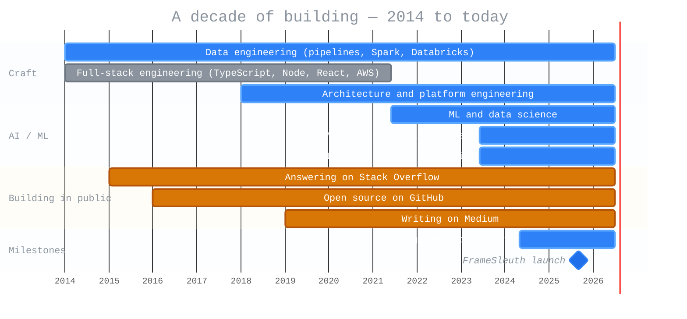
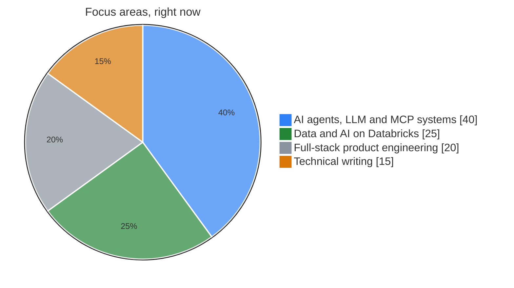

<h1 align="center">Santosh Shinde</h1>

  

  
  
  

 

<table border="0" cellpadding="0" cellspacing="0">
  <tr>
    <td width="34%" align="center" valign="middle">
      
    </td>
    <td width="68%" valign="middle">
      
I'm an <b>AI Lead Engineer at Syngenta</b>, based in Pune. I design and ship LLM-powered products — RAG pipelines, evaluation loops, and the MLOps plumbing that keeps them running in production.

      
My focus is <b>AI/ML — powered by deep full-stack engineering roots</b>. That combination lets me bridge the gap between a working model and a product people can actually rely on.

      
<i>The model is the easy part. The hard part is everything around it — retrieval, evals, failure modes, cost, and the team that maintains it six months from now. That's what I write about.</i>

    </td>
  </tr>
</table>

---

## What I'm Building — FrameSleuth

> ### *"Turn any video into code your agent can ship."*

**[FrameSleuth](https://www.framesleuth.com/)** is a local-first AI system that converts screen recordings into structured, evidence-cited context bundles for coding agents. Record a bug or a feature demo — it reads every frame, transcribes the narration, and captures console and network activity, then hands your agent repro steps, error evidence, and code candidates it can act on.

  
  
  
  
  

---

## How I Think About the Work

- **End-to-end systems** — not the model in isolation, the full pipeline. Most of the value (and most of the bugs) live between the boxes on the architecture diagram.
- **Tradeoffs that matter to the business** — Lakebase vs Lakehouse, batch vs streaming, RAG vs fine-tuning. These show up in latency, cost, and risk — not just engineering preference.
- **The unglamorous production work** — eval harnesses, observability for non-deterministic systems, drift, and guardrails. The stuff that separates a demo from something you can trust on a Tuesday morning.

---

## My Engineering Journey

> A decade of building — from data pipelines and full-stack apps to production AI, with a habit of sharing what I learn along the way.

---

## Where I Spend My Time

---

## How I Navigate the Work

Not every problem lives in the same place. I map what I build to the [Cynefin](https://en.wikipedia.org/wiki/Cynefin_framework) domains — because the right approach for a known CRUD API is the wrong approach for a non-deterministic agent.

  

---

## Featured Projects

**AI, Agents & Products**

| Project | What it is |
| --- | --- |
| **[FrameSleuth](https://www.framesleuth.com/)** | Local-first AI that turns video into evidence-cited context bundles for coding agents. MCP-ready. |
| **[multi-agent-sales-ops-tpch-databricks](https://github.com/santoshshinde2012/multi-agent-sales-ops-tpch-databricks)** | Beyond Genie code — orchestrating production multi-agent systems on Databricks. [Write-up →](https://medium.com/data-science-collective/beyond-genie-code-orchestrating-production-multi-agent-systems-on-databricks-86ac51e9c55b) |
| **[ai-consumption-plane](https://github.com/santoshshinde2012/ai-consumption-plane)** | A hands-on build of the AI Consumption Plane on Databricks. |
| **[crop-disease-prediction](https://github.com/santoshshinde2012/crop-disease-prediction)** | Crop-disease image classification — applied ML for agriculture. |

**Data Engineering & Platform**

| Project | What it is |
| --- | --- |
| **[medallion-architecture-databrics](https://github.com/santoshshinde2012/medallion-architecture-databrics)** | Medallion Architecture — principles and a practical Databricks exploration. [Read →](https://blog.santoshshinde.com/medallion-architecture-principles-and-practical-exploration-425834ae3bc7) |
| **[dataset-atlas](https://github.com/santoshshinde2012/dataset-atlas)** | A map-first way to discover and download datasets — Region → Domain → Get. [Live demo →](https://santoshshinde2012.github.io/dataset-atlas/) |
| **[node-boilerplate](https://github.com/santoshshinde2012/node-boilerplate)** — 460 stars | Production-ready Node.js + TypeScript skeleton for microservices — ESLint, Prettier, Husky, CI wired in. |

---

## Latest Writing

<!-- BLOG-POST-LIST:START -->
- [The AI Consumption Plane on Data-bricks: A Hands-On Build](https://levelup.gitconnected.com/the-ai-consumption-plane-on-data-bricks-a-hands-on-build-0e923143252d?source=rss-f5cfa346da5------2)
- [The Medallion Architecture Reconsidered: What It Solved, and Where It’s Cracking](https://levelup.gitconnected.com/the-medallion-architecture-reconsidered-what-it-solved-and-where-its-cracking-d6073aa1b0fd?source=rss-f5cfa346da5------2)
- [Building a Production MCP Server That Handles Real API Complexity (Part 2)](https://medium.com/data-science-collective/building-a-production-mcp-server-that-handles-real-api-complexity-part-2-303137e79034?source=rss-f5cfa346da5------2)
- [How Production Teams Are Designing MCP Systems That Actually Scale (Part 1)](https://medium.com/data-science-collective/how-production-teams-are-designing-mcp-systems-that-actually-scale-part-1-1d1515e20cc6?source=rss-f5cfa346da5------2)
- [Building an AI Video Agent: Turning Recordings into Tests (Part 6)](https://medium.com/data-science-collective/building-a-ai-video-agent-turning-recordings-into-tests-part-6-1ca8ef8d5ff7?source=rss-f5cfa346da5------2)
- [Building an AI Video Agent: One Engine, Many Bundles (Part 5)](https://medium.com/data-science-collective/building-a-ai-video-agent-one-engine-many-bundles-part-5-d967934ce109?source=rss-f5cfa346da5------2)
- [Building an AI Video Agent: The Bundle Is the Contract (Part 4)](https://medium.com/data-science-collective/building-a-ai-video-agent-the-bundle-is-the-contract-part-4-2471254dc37b?source=rss-f5cfa346da5------2)
- [Building an AI Video Agent: Reading the Screen (Part 3)](https://medium.com/data-science-collective/building-an-ai-video-agent-reading-the-screen-part-3-6007a5f98959?source=rss-f5cfa346da5------2)
- [Building an AI Video Agent: From WebM to Keyframes (Part 2)](https://medium.com/data-science-collective/building-a-ai-video-agent-from-webm-to-keyframes-part-2-8687cd3c6370?source=rss-f5cfa346da5------2)
- [Building a Local AI Video Agent: Architecture, Patterns, and the Hard Problems (Part 1)](https://medium.com/data-science-collective/building-a-local-ai-video-agent-architecture-patterns-and-the-hard-problems-part-1-7b700273021c?source=rss-f5cfa346da5------2)
<!-- BLOG-POST-LIST:END -->

More on [Medium →](https://medium.com/@santosh-shinde)

---

<i>Open to conversations about production LLM systems, MLOps, and agent tooling — reach me on <a href="https://www.linkedin.com/in/shindesantosh">LinkedIn</a>.</i>

