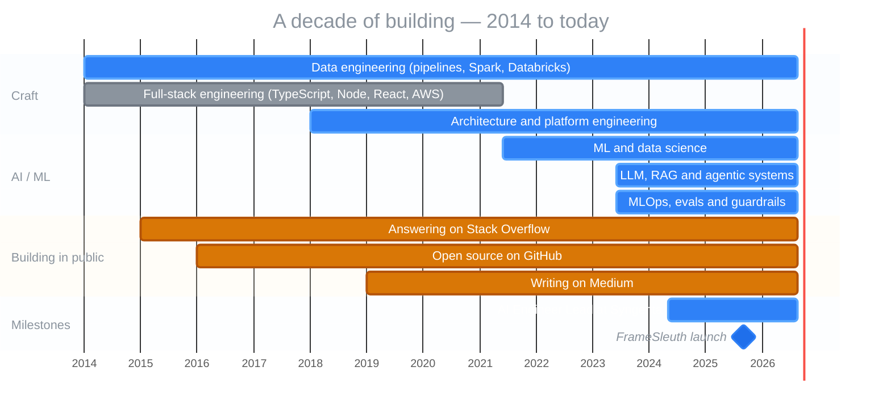
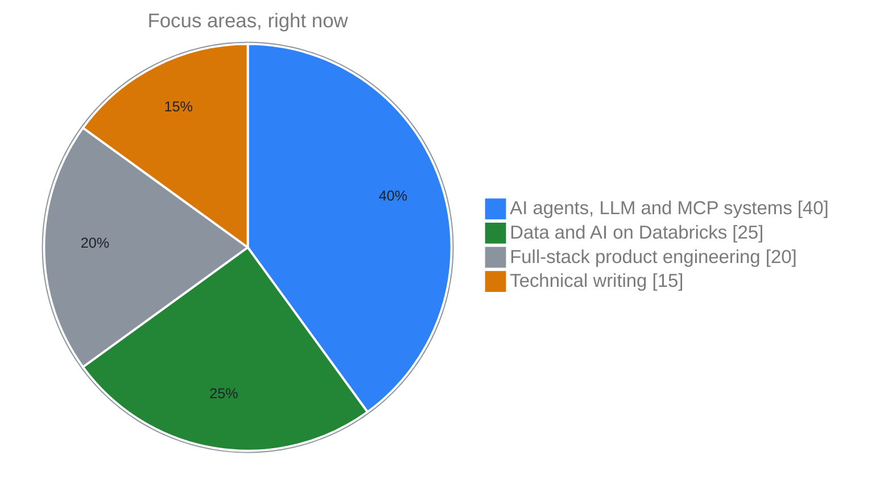

<h1 align="center">Santosh Shinde</h1>

  

  <a href="https://www.linkedin.com/in/shindesantosh">
    <!-- Inline logo: simple-icons dropped LinkedIn's mark, so `logo=linkedin` renders text-only. -->
    
  </a>
  
  
  
  

 

<table border="0" cellpadding="0" cellspacing="0">
  <tr>
    <td width="32%" align="center" valign="middle">
      
    </td>
    <td width="68%" valign="middle">
      
I'm an <b>AI Engineer Lead at Syngenta</b>, based in Pune. I design and ship LLM-powered products — RAG pipelines, evaluation loops, and the MLOps plumbing that keeps them running in production.

      
My focus is <b>AI/ML — powered by deep full-stack engineering roots</b>. That combination lets me bridge the gap between a working model and a product people can actually rely on.

      
<i>The model is the easy part. The hard part is everything around it — retrieval, evals, failure modes, cost, and the team that maintains it six months from now. That's what I write about.</i>

    </td>
  </tr>
</table>

---

## Proof, Not Claims

I'd rather show working systems than list skills. Everything here runs and is inspectable:

| Working system | What it demonstrates | Source |
| --- | --- | --- |
| **FrameSleuth agent** | The open-source MCP server behind [FrameSleuth](https://www.framesleuth.com/) — local video → structured Context Bundle, no frames leaving the machine. I wrote the initial commit and most of what followed. | [repo](https://github.com/thestackhub1/framesleuth-agent) · [site](https://www.framesleuth.com/) |
| **ask-santosh** | Retrieval-augmented Q&A over my writing, with a reproducible **DeepEval** suite (faithfulness · answer-relevancy · contextual-relevancy) gating answer quality in CI | [repo](https://github.com/santoshshinde2012/ask-santosh) |
| **Multi-agent on Databricks** | Production multi-agent orchestration, beyond Genie code | [repo](https://github.com/santoshshinde2012/multi-agent-sales-ops-tpch-databricks) · [write-up](https://medium.com/data-science-collective/beyond-genie-code-orchestrating-production-multi-agent-systems-on-databricks-86ac51e9c55b) |
| **This profile** | The section below is regenerated weekly from my real GitHub activity by a scheduled workflow. Its footnote states how each run was produced, so the claim can't drift from what actually ran. | [workflow](.github/workflows/ai-summary.yml) · [script](scripts/ai_summary.py) |

---

## What I'm Shipping Lately

<!-- AI-SUMMARY:START -->
- **[churn-vs-risk-poc](https://github.com/santoshshinde2012/churn-vs-risk-poc)** — 1 commit
- **[framesleuth-agent](https://github.com/thestackhub1/framesleuth-agent)** — Finish the lockfile migration — 22 more places still said the old thing _(+5 more)_

Built from my last 21 days of public GitHub activity · [workflow](.github/workflows/ai-summary.yml) · updated Aug 17, 2026
<!-- AI-SUMMARY:END -->

---

## What I'm Building — FrameSleuth

> ### *"Turn any video into code your agent can ship."*

**[FrameSleuth](https://www.framesleuth.com/)** is a local-first AI system that converts screen recordings into structured, evidence-cited context bundles for coding agents. Record a bug or a feature demo — it reads every frame, transcribes the narration, and captures console and network activity, then hands your agent repro steps, error evidence, and code candidates it can act on.

I build and maintain **[`framesleuth-agent`](https://github.com/thestackhub1/framesleuth-agent)** — the open-source Python MCP server underneath it. Local video in, structured Context Bundle out, over MCP. It's public, so you can read the pipeline rather than take my word for it: keyframe extraction, transcript alignment, bundle contract, Docker image built from a pinned lockfile in CI.

  
  
  
  
  
  

---

## How I Think About the Work

- **End-to-end systems** — not the model in isolation, the full pipeline. Most of the value (and most of the bugs) live between the boxes on the architecture diagram.
- **Tradeoffs that matter to the business** — Lakebase vs Lakehouse, batch vs streaming, RAG vs fine-tuning. These show up in latency, cost, and risk — not just engineering preference.
- **The unglamorous production work** — eval harnesses, observability for non-deterministic systems, drift, and guardrails. The stuff that separates a demo from something you can trust on a Tuesday morning.

---

## My Engineering Journey

> A decade of building — from data pipelines and full-stack apps to production AI, with a habit of sharing what I learn along the way.

```mermaid
%%{init: {'theme':'base','themeVariables':{'fontFamily':'Fira Code, monospace','taskBkgColor':'#1F6FEB','taskBorderColor':'#2F81F7','activeTaskBkgColor':'#2F81F7','activeTaskBorderColor':'#58A6FF','doneTaskBkgColor':'#8B949E','doneTaskBorderColor':'#6E7681','critBkgColor':'#D97706','critBorderColor':'#B45309','critTextColor':'#ffffff','milestoneBkgColor':'#238636','milestoneBorderColor':'#2EA043','taskTextColor':'#ffffff','taskTextDarkColor':'#ffffff','taskTextLightColor':'#ffffff','taskTextOutsideColor':'#8B949E','gridColor':'#30363D','todayLineColor':'#F85149','titleColor':'#8B949E','sectionBkgColor':'#2F81F714','altSectionBkgColor':'#2F81F70A'}}}%%
gantt
    title A decade of building — 2014 to today
    dateFormat YYYY-MM-DD
    axisFormat %Y
    tickInterval 1year

    section Craft
    Data engineering (pipelines, Spark, Databricks)      :active, de,   2014-01-01, 2026-08-17
    Full-stack engineering (TypeScript, Node, React, AWS) :done,   fs,   2014-01-01, 2021-06-01
    Architecture and platform engineering                :active, arch, 2018-01-01, 2026-08-17

    section AI / ML
    ML and data science                                  :active, ml,   2021-06-01, 2026-08-17
    LLM, RAG and agentic systems                         :active, llm,  2023-06-01, 2026-08-17
    MLOps, evals and guardrails                          :active, ops,  2023-06-01, 2026-08-17

    section Building in public
    Answering on Stack Overflow                          :crit, so,   2015-01-01, 2026-08-17
    Open source on GitHub                                :crit, gh,   2016-01-01, 2026-08-17
    Writing on Medium                                    :crit, med,  2019-01-01, 2026-08-17

    section Milestones
    AI Engineer Lead at Syngenta                         :active,    syn, 2024-05-01, 2026-08-17
    FrameSleuth launch                                   :milestone, fsl, 2025-09-01, 0d
```

---

## Where I Spend My Time

```mermaid
%%{init: {'theme':'base','themeVariables':{'pie1':'#2F81F7','pie2':'#238636','pie3':'#8B949E','pie4':'#D97706','pieOpacity':'1','pieStrokeColor':'#ffffff','pieStrokeWidth':'2px','pieOuterStrokeColor':'#8B949E','pieTitleTextSize':'18px','pieTitleTextColor':'#7A7A7A','pieSectionTextSize':'13px','pieSectionTextColor':'#1F2328','pieLegendTextColor':'#7A7A7A'}}}%%
pie showData
    title Focus areas, right now
    "AI agents, LLM and MCP systems" : 40
    "Data and AI on Databricks" : 25
    "Full-stack product engineering" : 20
    "Technical writing" : 15
```

---

## How I Navigate the Work

Not every problem lives in the same place. I map what I build to the [Cynefin](https://en.wikipedia.org/wiki/Cynefin_framework) domains — because the right approach for a known CRUD API is the wrong approach for a non-deterministic agent.

  

---

## Featured Projects

**AI, Agents & Products**

| Project | What it is |
| --- | --- |
| **[framesleuth-agent](https://github.com/thestackhub1/framesleuth-agent)** | The open-source MCP server behind FrameSleuth — local video → structured Context Bundle. Python, Docker, pinned lockfile, CI. |
| **[ask-santosh](https://github.com/santoshshinde2012/ask-santosh)** | RAG over my own writing, with a DeepEval suite gating faithfulness and relevancy in CI. |
| **[multi-agent-sales-ops-tpch-databricks](https://github.com/santoshshinde2012/multi-agent-sales-ops-tpch-databricks)** | Beyond Genie code — orchestrating production multi-agent systems on Databricks. [Write-up →](https://medium.com/data-science-collective/beyond-genie-code-orchestrating-production-multi-agent-systems-on-databricks-86ac51e9c55b) |
| **[ai-consumption-plane](https://github.com/santoshshinde2012/ai-consumption-plane)** | A hands-on build of the AI Consumption Plane on Databricks. |
| **[churn-vs-risk-poc](https://github.com/santoshshinde2012/churn-vs-risk-poc)** | Why a churn model is not a risk model — and what that costs you. [Write-up →](https://medium.com/ai-that-ships/why-your-churn-model-is-not-a-risk-model-and-why-it-matters-963e1f9bd2e9) |
| **[crop-disease-prediction](https://github.com/santoshshinde2012/crop-disease-prediction)** | Crop-disease image classification — applied ML for agriculture. |

**Data Engineering & Platform**

| Project | What it is |
| --- | --- |
| **[medallion-architecture-databrics](https://github.com/santoshshinde2012/medallion-architecture-databrics)** | Medallion Architecture — principles and a practical Databricks exploration. [Read →](https://blog.santoshshinde.com/medallion-architecture-principles-and-practical-exploration-425834ae3bc7) |
| **[dataset-atlas](https://github.com/santoshshinde2012/dataset-atlas)** | A map-first way to discover and download datasets — Region → Domain → Get. [Live demo →](https://santoshshinde2012.github.io/dataset-atlas/) |
| **[node-boilerplate](https://github.com/santoshshinde2012/node-boilerplate)**  | Production-ready Node.js + TypeScript skeleton for microservices — ESLint, Prettier, Husky, CI wired in. |
| **[genie-reality-check](https://github.com/santoshshinde2012/genie-reality-check)** | Chart data and methodology behind my Databricks Genie evaluation series. |

---

## Latest Writing

<!-- BLOG-POST-LIST:START -->
- [Why Your Churn Model Is Not a Risk Model (And Why It Matters)](https://medium.com/ai-that-ships/why-your-churn-model-is-not-a-risk-model-and-why-it-matters-963e1f9bd2e9)
- [Databricks Genie: Agent Mode vs Chat Mode — Should You Switch Yet?](https://medium.com/ai-that-ships/databricks-genie-agent-mode-vs-chat-mode-should-you-switch-yet-fc9b8bf65032)
- [Feature Store vs. Gold Data Products: Where Should Your ML Features Live?](https://medium.com/ai-that-ships/feature-store-vs-gold-data-products-where-should-your-ml-features-live-4d75011982a5)
- [What Genie Ontology Actually Automates, and What It Leaves to You](https://medium.com/ai-that-ships/what-genie-ontology-actually-automates-and-what-it-leaves-to-you-95f16458fc85)
- [Data Governance on the Ground — and the Challenges AI Agents Bring](https://medium.com/ai-that-ships/data-governance-on-the-ground-and-the-challenges-ai-agents-bring-49a38acc63cc)
- [Every Design Pattern Casts a Shadow in Machine Learning](https://levelup.gitconnected.com/every-design-pattern-casts-a-shadow-in-machine-learning-c16f727fea02)
- [The Four Debts of AI-Assisted Engineering (and the Four Gates That Pay Them Down)](https://levelup.gitconnected.com/the-four-debts-of-ai-assisted-engineering-and-the-four-gates-that-pay-them-down-bd7383acb5f2)
- [Genie’s Two Meters: The One Your Budget Sees, and the One It Doesn’t](https://levelup.gitconnected.com/genies-two-meters-the-one-your-budget-sees-and-the-one-it-doesn-t-23ad1d1dabea)
<!-- BLOG-POST-LIST:END -->

I publish most of this through **[AI That Ships](https://medium.com/ai-that-ships)** — my Medium publication on getting AI systems into production, also on [Substack](https://aithatship.substack.com/). More on [Medium →](https://medium.com/@santosh-shinde)

---

<i>Open to conversations about production LLM systems, MLOps, and agent tooling — reach me on <a href="https://www.linkedin.com/in/shindesantosh">LinkedIn</a>.</i>

